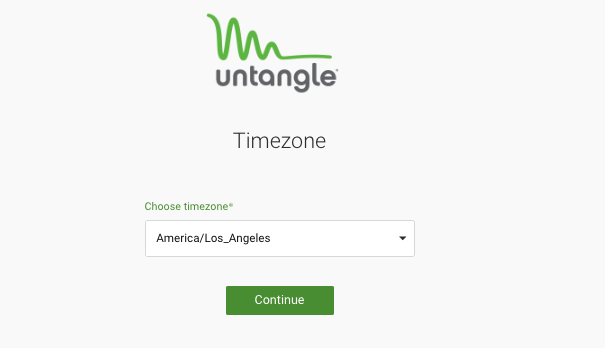
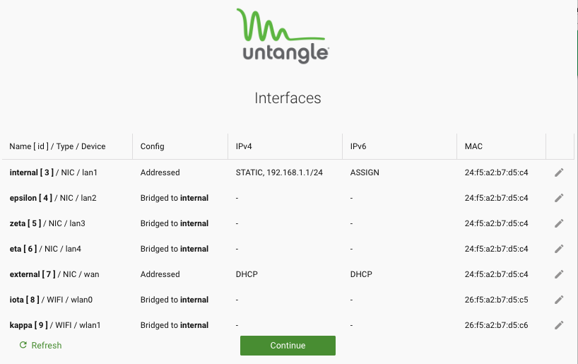
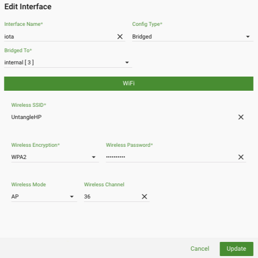

SD-WAN Router Beta
==================

The following document provides a brief overview of the SD-WAN router beta.

Beware: This beta is intended to show the future direction of the SD-WAN router.
It is still very much a beta. It has bugs and features still missing.
While it is a young product, it should be stable and is very fast, even on tiny hardware.
It will allow you to get a sneak peak at the future direction and some of the exciting technology on the way.

Overview
--------

What is the SD-WAN Router?
~~~~~~~~~~~~~~~~~~~~~~~~~~

In short, it is a router optimized for "SD-WAN" (software defined WANs)
type deployments. These are typically sites with several internet
connections, and perhaps "virtual" internet connections through tunnel
connections to cloud services.
An SD-WAN router specializes in maximizing performance, reliability, and
security of the connection. SD-WAN routers are often used to handle
multisite deployments and are coupled with inexpensive on-prem hardware,
being cloud managed, and with security services in the cloud.

How is this different than NGFW?
~~~~~~~~~~~~~~~~~~~~~~~~~~~~~~~~

SD-WAN routers and NGFW/UTM have a great deal of overlap. NGFW and UTMs
main focus is on security and have some advanced functionality. SD-WAN
router's main focus is smart routing for maximized performance and
reliability, but also have some security technology. NGFW/UTM typically
use heavy gateway devices to perform expensive security technologies at
each physical gateway. SD-WAN promises to move some of these
technologies to data-centers and cloud providers, and use more
inexpensive and simpler physical gateway devices that are cloud managed.

Don't worry, much of the stuff you love about Untangle (like reports)
are still the same!

Is the SD-WAN Router free? Open source?
~~~~~~~~~~~~~~~~~~~~~~~~~~~~~~~~~~~~~~~

Similar to NGFW, the SD-WAN Router is open source (GPLv2).
However, it does rely on several commercial cloud intelligence services that provide data and or services.
Also similar to NGFW, the SD-WAN Router will have a free version and a paid version. The free version
will be full functionality, and will be available as a Linksys build.
Other builds will be made available with licensing based on throughput.

Beta Testing
------------

To get started on the beta test first you must get one of the currently supported platforms. We'll be making turnkey hardware options available in the future.
For this beta, you can use a Linksys Router, or you can install it on Oracle VirtualBox as an easy way to try out the product.

- `Click for beta Installation Instructions for Oracle VirtualBox <betaoraclevirtualbox.html>`_
- `Click for beta Installation Instructions for a Linksys WRT Router <betalinksys.html>`_

Setup Wizard
~~~~~~~~~~~~

Once installed, connect to 192.168.1.1 to see the setup wizard.

.. image:: images/beta/sdwan_setup.png
    :scale: 30%

The setup wizard will walk you through basic configuration of the SD-WAN router.  The setup wizard will look different as you upgrade to different beta versions.

Step 1 allows you to choose a new password.

**IMPORTANT**: For better debugging SSH and HTTP are available by default on the WAN. This allows easier access to troubleshoot if something goes wrong.
This will likely change at some point, but for now **choose a good password**.

Step 2 allows you to choose a timezone. It will pick a default for you that you can change if needed.

Step 3 allows you to configure the interfaces.

On each row, you can see interfaces (for example, Internal lan1) with their configuration.  You can click to edit any of the interfaces to change the defaults.
If one of your interfaces is a WiFi interface, click to edit it, and set up the SSID and password.

The defaults are likely the best options. The 4 lan (lan1-lan4) ports and the two wifi cards (wlan0-wlan1) are bridged together into your "internal" zone.
The wan port (labeled "internet" physically) is configured for DHCP and DHCP6, you may configure it statically if DHCP is not available.

After this the device is fully configured!

A Quick Tour
------------

Lets get to know your SD-WAN router

Dashboard & Reports
~~~~~~~~~~~~~~~~~~~

The first step to optimizing your network traffic for maximum performance is seeing and understanding what traffic is on the network.
Unlike almost all firmware solutions, the SD-WAN router has extensive reporting that allow close inspection and monitoring of network traffic.

.. image:: images/beta/dashboard.png
    :scale: 40%

For those familiar with NGFW, you'll be right at home. These reports and dashboard are very similar.

Individual reports can be viewed under reports.
You can zoom in on charts and hide certain values from the key by clicking on them.
You can view the data by clicking on the data icon in the upper right.
You can customize the view by clickin on the settings icon (changes are not saved for now though).
You can add conditions at the top to view the given report, but through the specified "filter," like for a specific client, application, port, etc.

The customizable dashboard shows a collection of reports over the specified timeframe.
This can be used to keep a continuous view of activity on the network.
Similar to reports you can add conditions to view a specific client, application, port, etc.
Widgets can be added by clicking on the "Widgets" in the upper right.

(Don't worry - custom widgets like NGFW are coming soon!)

Settings
~~~~~~~~

The settings are where all the router settings live.

- "Network" contains all the network configuration related settings, like interfaces and DNS.

- "Firewall" contains all the firewall rules configuration.
  This section is very different than NGFW and will be more documented in the future.
  Essentially, the SD-WAN router is gathering all the layer-7 intelligence (similar to NGFW) but "injecting" it into the kernel so it can be used in a layer-3 firewall. This gives you the power of layer-7, but the performance of layer-3.
  Rules are powerful, but can be a bit hard to configure - more info coming on this soon!

- "Smart Routing" contains all the SD-WAN logic, from intelligent path selection and balancing based on latency, bandwidth, jitter, etc.
  This section ensure you can get the maximum performance if using multiple WANs (be they physical or VPN tunnels).
  *NOTE:* This section has been disabled for beta until we are confident it is working as expected. Similarly virtual WANs (OpenVPN, Wireguard, etc) are also not available.

- "System" contains all the system settings.
  You can change the hostname/domainname here, or the admin password.
  Eventually many settings, like timezone, language, etc will live here.

- "Monitor" will show the sessions/hosts/users/devices - very similar to NGFW.
  This section in currently unimplemented.

Upgrade to a newer version from the administration UI
~~~~~~~~~~~~~~~~~~~~~~~~~~~~~~~~~~~~~~~~~~~~~~~~~~~~~

Once you've installed the SD-WAn Router, you'll be able to upgrade to new versions from the administration UI.  Go to System -> Settings -> Upgrade.
- Downloading the latest version from this page to any machine where you can access your SD-WAN Router.
- Go to the SD-WAN Router administration interface under Settings -> System -> Upgrade.
- Select "Browse" and find the file that you downloaded from this page
- Select the "Upload' button, your SD-WAN Router will upload the file to your router and initiate the upgrade.
- Wait a few minutes for the upgrade to take place.

Feedback
~~~~~~~~

The goal of the beta program is to show some of the upcoming tech, but also to gather feedback and make sure we're on the right track.

Is there something you would love to see that is critical functionality?
Is there something that you would like to see improved?
Did you have a problem or encounter a bug?

Please let us know!
