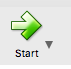

SD-WAN Router Beta
==================

The following document provides a brief overview of the SD-WAN router beta.

Beware: This beta is intended to show the future direction of the SD-WAN router.
It is still very much a beta. It has many bugs and many features still missing.
However, while it is a young product, it should be stable and is very fast, even on tiny hardware.
It will allow you to get a sneak peak at the future direction and some of the exciting technology on the way.

Overview
--------

What is the SD-WAN Router?
~~~~~~~~~~~~~~~~~~~~~~~~~~

In short, its a router optimized for "SD-WAN" (software defined WANs) 
type deployments. These are typically sites with several internet 
connections, and perhaps "virtual" internet connections through tunnel 
connections to cloud services.
An SD-WAN router specializes in maximizing performance, reliability, and 
security of the connection. SD-WAN routers are often used to handle 
multisite deployments and are coupled with inexpensive on-prem hardware, 
being cloud managed, and with security services in the cloud.

How is this different than NGFW?
~~~~~~~~~~~~~~~~~~~~~~~~~~~~~~~~

SD-WAN routers and NGFW/UTM have a great deal of overlap. NGFW and UTMs 
main focus is on security and have some advanced functionality. SD-WAN 
router's main focus is smart routing for maximized performance and 
reliability, but also have some security technology. NGFW/UTM typically 
use heavy gateway devices to perform expensive security technologies at 
each physical gateway. SD-WAN promises to move some of these 
technologies to data-centers and cloud providers, and use more 
inexpensive and simpler physical gateway devices that are cloud managed.

Don't worry, much of the stuff you love about Untangle (like reports) 
are still the same!

Is the SD-WAN Router free? Open source?
~~~~~~~~~~~~~~~~~~~~~~~~~~~~~~~~~~~~~~~

Similar to NGFW, the SD-WAN Router is open source (GPLv2).
However, it does rely on several commercial cloud intelligence services that provide data and or services.
Also similar to NGFW, the SD-WAN Router will have a free version and a paid version, however the free version
will be full functionality, but limited in throughput. Sites with less throughput can use the SD-WAN router (with full functionality) for free.
Sites with more sites will need to purchase a subscription to get increasing levels of throughput.

*NOTE:* The throughput limit has been disabled for the beta because the beta has much SD-WAN functionality currently disabled.

Beta Testing
------------

To get started on the beta test first you must get one of the currently supported platforms.

Hardware
~~~~~~~~

In the long term, we hope to support more platforms. If you have feedback about desired platforms, we would love to hear it.
In the meantime we have selected three widely available highly performant (yet affordable) routers:

- `Linksys WRT-1900ACS <https://www.linksys.com/us/p/P-WRT1900ACS/>`_
- `Linksys WRT-3200ACM <https://www.linksys.com/us/p/P-WRT3200ACM/>`_
- `Linksys WRT-32X <https://www.linksys.com/us/p/P-WRT32X/>`_

Beware: The model number must be exact! - For example, the WRT1900AC is not the same as the WRT1900ACS.

You can also install the SD-WAN beta onto Oracle VirtualBox on a Windows or Mac device. See Oracle VirtualBox instructions further down.

Installation onto a Linksys Router
~~~~~~~~~~~~~~~~~~~~~~~~~~~~~~~~~

First, install your router as normal, with the "Internet" port plugged into your internet/modem or upstream router/switch.
Also, connect your installation device (PC, tablet, phone) to one of the LAN ports, or connect wirelessly using the
information provided by Linksys.

The default internal IP of the linksys is 192.168.1.1, so connect to "http://192.168.1.1" in your browser and follow the Linksys instructions.
After installation is complete and the installation device is online you can flash the SD-WAN router firmware.

Flashing onto a Linksys Router
~~~~~~~~~~~~~~~~~~~~~~~~~~~~~~

Download the appropriate firmware for your router.

- `Linksys WRT-1900ACS SD-WAN router factory firmware <http://download.untangle.com/sdwan/beta/sdwan-wrt1900acs-factory_v0.1.0beta1-42-gb4a7e2aeb8_20190318T0839.img>`_
- `Linksys WRT-3200ACM SD-WAN router factory firmware <http://download.untangle.com/sdwan/beta/sdwan-wrt3200acm-factory_v0.1.0beta1-42-gb4a7e2aeb8_20190318T0836.img>`_
- `Linksys WRT-32X SD-WAN router factory firmware <http://download.untangle.com/sdwan/beta/sdwan-wrt32x-factory_v0.1.0beta1-42-gb4a7e2aeb8_20190318T0839.img>`_

Or the virtual image:

- `VirtualBox VDI <http://download.untangle.com/sdwan/beta/sdwan-x86-64-combined_v0.1.0beta1-42-gb4a7e2aeb8_20190318T0838.vdi>`_
- `VMWare VMDK <http://download.untangle.com/sdwan/beta/sdwan-x86-64-combined_v0.1.0beta1-42-gb4a7e2aeb8_20190318T0838.vmdk>`_

In the linksys administration UI click on "Connectivity"

.. image:: images/beta/linksys_1.png
    :scale: 30%

Then select "Choose File" and choose the file you downloaded above. Then select "Start."

.. image:: images/beta/linksys_2.png
    :scale: 30%

At this point the router will begin the flashing process. Wait 2 minutes, get a coffee - relax.
Do not reboot the router.

The Linksys administration interface will wait for the linksys to return, but it will not.
Instead you need to close that window and connect to "http://192.168.1.1" in a new tab.

*NOTE:* If you were using another subnet before (something other than 192.168.1.x) you may need to reboot your device or refresh your DHCP Lease.
If you are connecting wirelessly, you will need to connect to the "Untangle" SSID with a password of "12345678".

Setup Wizard
~~~~~~~~~~~~

Once connected to 192.168.1.1 you will see the setup wizard.

.. image:: images/beta/sdwan_setup.png
    :scale: 30%

The setup wizard will walk you through basic configuration of the SD-WAN router.  The setup wizard will look different as you upgrade to different beta versions.

Step 1 allows you to choose a new password.

**IMPORTANT**: For better debugging SSH and HTTP are available by default on the WAN. This allows easier access to troubleshoot if something goes wrong.
This will likely change at some point, but for now **choose a good password**.

Step 2 allows you to choose a timezone. It will pick a default for you that you can change if needed.

    
Step 3 allows you to configure the interfaces.

On each row, you can see interfaces (for example, Internal lan1) with their configuration.  You can click to edit any of the interfaces to change the defaults.
If one of your interfaces is a WiFi interface, click to edit it, and set up the SSID and password.

The defaults are likely the best options. The 4 lan (lan1-lan4) ports and the two wifi cards (wlan0-wlan1) are bridged together into your "internal" zone.
The wan port (labeled "internet" physically) is configured for DHCP and DHCP6, you may configure it statically if DHCP is not available.

After this the device is fully configured!

A Quick Tour
------------

Lets get to know your SD-WAN router

Dashboard & Reports
~~~~~~~~~~~~~~~~~~~

The first step to optimizing your network traffic for maximum performance is seeing and understanding what traffic is on the network.
Unlike almost all firmware solutions, the SD-WAN router has extensive reporting that allow close inspection and monitoring of network traffic.

.. image:: images/beta/dashboard.png
    :scale: 40%

For those familiar with NGFW, you'll be right at home. These reports and dashboard are very similar.

Individual reports can be viewed under reports.
You can zoom in on charts and hide certain values from the key by clicking on them.
You can view the data by clicking on the data icon in the upper right.
You can customize the view by clickin on the settings icon (changes are not saved for now though).
You can add conditions at the top to view the given report, but through the specified "filter," like for a specific client, application, port, etc.

The customizable dashboard shows a collection of reports over the specified timeframe.
This can be used to keep a continuous view of activity on the network.
Similar to reports you can add conditions to view a specific client, application, port, etc.
Widgets can be added by clicking on the "Widgets" in the upper right.

(Don't worry - custom widgets like NGFW are coming soon!)

Settings
~~~~~~~~

The settings are where all the router settings live.

- "Network" contains all the network configuration related settings, like interfaces and DNS.

- "Firewall" contains all the firewall rules configuration.
  This section is very different than NGFW and will be more documented in the future.
  Essentially, the SD-WAN router is gathering all the layer-7 intelligence (similar to NGFW) but "injecting" it into the kernel so it can be used in a layer-3 firewall. This gives you the power of layer-7, but the performance of layer-3.
  Rules are powerful, but can be a bit hard to configure - more info coming on this soon!

- "Smart Routing" contains all the SD-WAN logic, from intelligent path selection and balancing based on latency, bandwidth, jitter, etc.
  This section ensure you can get the maximum performance if using multiple WANs (be they physical or VPN tunnels).
  *NOTE:* This section has been disabled for beta until we are confident it is working as expected. Similarly virtual WANs (OpenVPN, Wireguard, etc) are also not available.

- "System" contains all the system settings.
  You can change the hostname/domainname here, or the admin password.
  Eventually many settings, like timezone, language, etc will live here.

- "Monitor" will show the sessions/hosts/users/devices - very similar to NGFW.
  This section in currently unimplemented.

Feedback
~~~~~~~~

The goal of the beta program is to show some of the upcoming tech, but also to gather feedback and make sure we're on the right track.

Is there something you would love to see that is critical functionality?
Is there something that you would like to see improved?
Did you have a problem or encounter a bug?

Please let us know!

Other Tips
----------

Resetting Linksys Routers to Factory Defaults
~~~~~~~~~~~~~~~~~~~~~~~~~

To reset to factory defaults (SD-WAN router defaults) just hold down the reset on the button for 10 seconds while booted up.
It will reboot when released and initialize new settings. At this point follow the Setup Wizard instructions above.

Reset to Linksys Firmware
~~~~~~~~~~~~~~~~~~~~~~~~~

Download the linksys firmware.

- `Linksys WRT1900ACS stock firmware <http://www.linksys.com/us/support-article?articleNum=165487>`_
- `Linksys WRT3200ACM stock firmware <https://www.linksys.com/us/support-article?articleNum=207552>`_
- `Linksys WRT32X stock firmware <https://www.linksys.com/us/support-article?articleNum=226203>`_

Rename it something like firmware.bin to make the following instructions easier.
  
Option 1 (Intermediate)

#. Download an SSH program if necessary (ssh for linux, putty/winscp for windows, ssh on mac)
#. scp the firmware to /tmp on your SD-WAN router.
#. ssh to your router (as root using the password configured for "admin")
#. run: ``dd if=/tmp/firmware.bin of=/dev/mtdblock4 bs=1M``
#. run: ``dd if=/tmp/firmware.bin of=/dev/mtdblock6 bs=1M``
#. run: ``sync``
#. reboot the device

Option 2 (Advanced)

If you have a USB tty connected, you can do so with uBoot and TFTP via some simple commands.
This requires cracking open the case and connecting your USB serial adapter to access uboot.
Then connect a LAN port to the TFTP server (or the network with the TFTP server)
Assuming the TFTP server is at 192.168.1.20, do the following::
  setenv ipaddr 192.168.1.100
  setenv serverip 192.168.1.20
  setenv firmwareName firmware.bin
  run update_both_images
  boot

Upgrade to a newer version from the administration UI
~~~~~~~~~~~~~~~~~~~~~~~~~~~~~~~~~~~~~~~~~~~~~~~~~~~~~
During beta, you can upgrade using the admin interface by downloading the latest version from this page, and then going to the SD-WAN Router administration interface under Settings -> System -> Upgrade.  Here, you can find the file that you downloaded from this page, and upload it to your SD-WAN Router. 
After clicking on the 'Upload' button, your SD-WAN Router will upload the file to your router and initiate the upgrade.  Wait a few minutes for the upgrade to take place.

Upgrading to a newer version using the Command Line Interface
~~~~~~~~~~~~~~~~~~~~~~~~~~~~~~~~~~~~~~~~~~~~~~~~~~~~~~~~~~~~~
Upgrading to a newer version can be accomplished from the CLI with the sysupgrade utility.

- `Linksys WRT-1900ACS SD-WAN router factory firmware <http://download.untangle.com/sdwan/beta/sdwan-wrt1900acs-factory_v0.1.0beta1-42-gb4a7e2aeb8_20190318T0839.img>`_
- `Linksys WRT-3200ACM SD-WAN router sysupgrade firmware <s3://download.untangle.com/sdwan/beta/sdwan-wrt3200acm-sysupgrade_v0.1.0beta1-42-gb4a7e2aeb8_20190318T0836.img>`_
- `Linksys WRT-32X SD-WAN router sysupgrade firmware <s3://download.untangle.com/sdwan/beta/sdwan-wrt32x-sysupgrade_v0.1.0beta1-42-gb4a7e2aeb8_20190318T0839.img>`_
  

#. Download the sysupgrade image, rename it to sysupgrade.img to make the following instructions easier
#. scp sysupgrade.img to your router in /tmp/
#. ssh to your router (as root using the password configured for "admin")
#. run: ``sysupgrade /tmp/sysupgrade.img``
#. Wait. The router will reflash and reboot.

*NOTE:* This process keeps existing settings/configuration.

Intalling SD-WAN Router onto Oracle VirtualBox
----------------------------------------------

- `Download Oracle VirtualBox <s3://https://www.virtualbox.org/wiki/Downloads>`_ for your OS.  VirtualBox is avaiable for WIndows, OS X, Linux and Solaris.

- Run VirtualBox and hit **New**
- Give your new install a name, e.g. **Untangle SD-WAN Router**
- Select **Type=Linux** and **Version="Other Linux(64-bit)"** or **Linux 2.6/3/x/4/x(64-bit)"**

.. image:: images/beta/mfw-vb-selection.jpg
    :scale: 40%

-Select **VDI (Virtual Box Disk Image)**
-Set **Storage on physical hard disk** to be **Dynamically Allocated**
- You can reduce the size of the virtual hard disk file, around 1 G is more than enough

.. image:: images/beta/image2019-2-25_11-46-30.png
    :scale: 40%
    
- Finish the wizard and then go to **Settings**
- On the **System** tab, you can remove **Floppy and CD**. we won't be using those. Select **Enable I/O APIC**
- Defaults are fine on the **Processor** tab, but you can use 2 CPU's if you want to.
- On the **Audio** tab, you can de-select **Enable Audio.** We won't be needing that.
- Under the **Network** tab, we're going to use **Adapter 1**, set to **Internal Network**, and **Adapter 2* set to **Bridged Adapter**. The order is important.

.. image:: images/beta/image2019-2-25_14-6-28.png
    :scale: 40%
    
- Go to the **Storage** tab, and under **Controller:IDE**, remove the **CD**.

.. image:: images/beta/image2019-2-25_14-21-56.png
    :scale: 40%
    
-Settings are now all set, so Click on the **Start** button.

    
- Once the terminal screen stops scrolling text, press return.  You are now at the command prompt.
- Type ip addr | grep inet
- From the list, look for an external IP address based on yoru network. For example, if your host machine (Windows/Mac) is using IP address 10.111.0.113, you'll see soething like this, which shows your external IP address as 10.111.0.154
.. image:: images/beta/image2019-2-28_12-48-2.png
    :scale: 40%
- Go to https://<your IP from above>> to set up your Untangle. Other than giving it a password, you should be able to accept the defaults and let it run.

