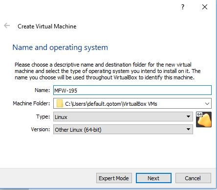

SD-WAN Router Beta
==================

Installing SD-WAN Router onto Oracle VirtualBox
----------------------------------------------

- `Download Oracle VirtualBox <s3://https://www.virtualbox.org/wiki/Downloads>`_ for your OS.  VirtualBox is available for WIndows, OS X, Linux and Solaris.

- Run VirtualBox and hit **New**
- Give your new install a name, e.g. **Untangle SD-WAN Router**
- Select **Type=Linux** and **Version="Other Linux(64-bit)"** or **Linux 2.6/3/x/4/x(64-bit)"**

-Select **VDI (Virtual Box Disk Image)**
-Set **Storage on physical hard disk** to be **Dynamically Allocated**
- You can reduce the size of the virtual hard disk file, around 1 G is more than enough

- Finish the wizard and then go to **Settings**
- On the **System** tab, you can remove **Floppy and CD**. we won't be using those. Select **Enable I/O APIC**
- Defaults are fine on the **Processor** tab, but you can use 2 CPU's if you want to.
- On the **Audio** tab, you can de-select **Enable Audio.** We won't be needing that.
- Under the **Network** tab, we're going to use **Adapter 1**, set to **Internal Network**, and **Adapter 2* set to **Bridged Adapter**. The order is important.

.. image:: images/beta/image2019-2-25_14-6-28.png
    :scale: 40%

- Go to the **Storage** tab, and under **Controller:IDE**, remove the **CD**.

.. image:: images/beta/image2019-2-25_14-21-56.png
    :scale: 40%

-Settings are now all set, so Click on the **Start** button.

.. image:: images/beta/image2019-2-25_14-22-41.png
    :scale: 40%

- Once the terminal screen stops scrolling text, press return.  You are now at the command prompt.
- Type ip addr | grep inet
- From the list, look for an external IP address based on yoru network. For example, if your host machine (Windows/Mac) is using IP address 10.111.0.113, you'll see soething like this, which shows your external IP address as 10.111.0.154
.. image:: images/beta/image2019-2-28_12-48-2.png
    :scale: 40%
- Go to https://<your IP from above>> to set up your Untangle. Other than giving it a password, you should be able to accept the defaults and let it run.
