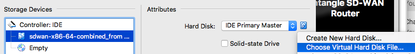

Untangle SD-WAN Router Beta
==================

Installing Untangle SD-WAN Router onto Oracle VirtualBox
----------------------------------------------

**Downloads**

- `Download Untangle SD-WAN Router for VirtualBox <http://download.untangle.com/sdwan/beta/sdwan-x86-64-combined_v0.1.0beta1-77-ge3845d7b2d_20190423T0553.vdi>`_

- `Download Oracle VirtualBox <https://www.virtualbox.org/wiki/Downloads>`_ for your OS.  VirtualBox is available for Windows, OS X, Linux and Solaris.

**Installation instructions**

- Run VirtualBox and hit **New**
- Give your new install a name, e.g. **Untangle SD-WAN Router**
- Select **Type=Linux** and **Version="Other Linux(64-bit)"** or **Linux 2.6/3/x/4/x(64-bit)"**

- On the **Memory size** screen, you can accept the default, or reduce the size of the virtual hard disk file, around 1 G is more than enough

- On the **Hard disk** screen, check "Create a virtual hard disk now"
- On the **Hard disk file type** screen, check "VDI (VirtualBox Disk Image)"

- Set **Storage on physical hard disk** to be **Dynamically Allocated**

.. image:: images/beta/image2019-2-25_11-46-30.png
    :scale: 70%

- On the **File location and size** screen, enter a name for your instance, and click on the folder icon to locate the Untangle SD-WAN Router for VirtualBox VDI image you downloaded.

- Finish the wizard and then go to **Settings**
- On the **System** tab, you can remove **Floppy and CD**. we won't be using those. Select **Enable I/O APIC**
- Defaults are fine on the **Processor** tab, but you can use 2 CPU's if you want to.
- On the **Audio** tab, you can de-select **Enable Audio.** We won't be needing that.
- Under the **Network** tab, we're going to use **Adapter 1**, set to **Internal Network**, and **Adapter 2* set to **Bridged Adapter**. The order is important.

- Go to the **Storage** tab, and under **Controller:IDE**, remove the **CD**.

-Settings are now all set, so Click on the **Start** button.

.. image:: images/beta/image2019-2-25_14-22-41.png
    :scale: 50%

- Once the terminal screen stops scrolling text, press return.  You are now at the command prompt.
- Type ip addr | grep inet
- From the list, look for an external IP address based on your network. For example, if your host machine (Windows/Mac) is using IP address 10.111.0.113, you'll see something like this, which shows your external IP address as 10.111.0.154

- Using a browser (e.g. Chrome) on the host machine, go to https://<your IP from above>> to set up your Untangle. Other than giving it a password, you should be able to accept the defaults and let it run.

If you don't get to the setup wizard, or the browser times out, enter into your browser <your ip from above>/setup
   for example 10.111.0.81/setup
This will take you directly to the setup wizard.

Upgrading to a newer version
~~~~~~~~~~~~~~~~~~~~~~~~~~~~~~~~~~~~~~~~~~~~~~~~~~~~~~~~~~~~~
When running SD-WAN Router on Oracle Virtualbox, during the beta, we recommend spinning up a new instance for the beta.  We'll provide upgrade through the Administration UI once the product is released.
