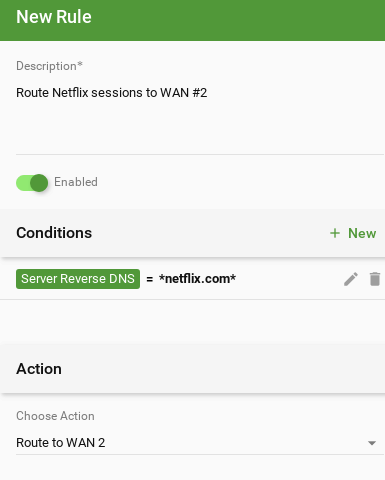
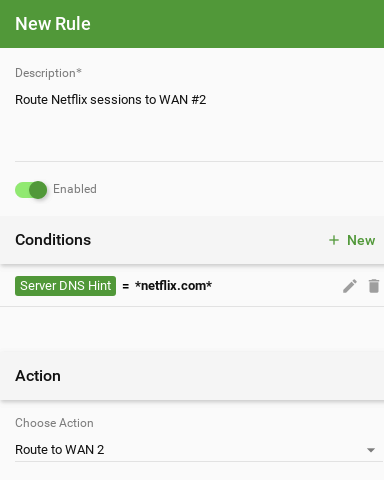
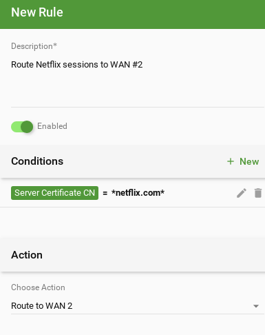
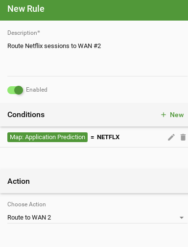
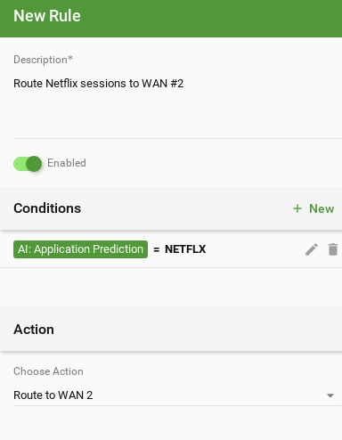
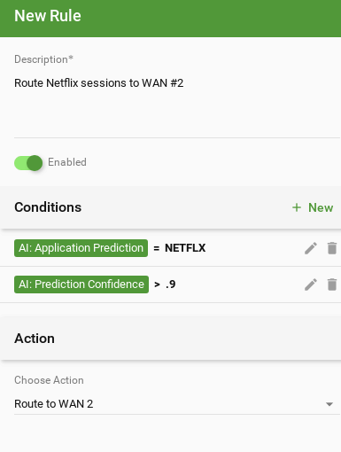
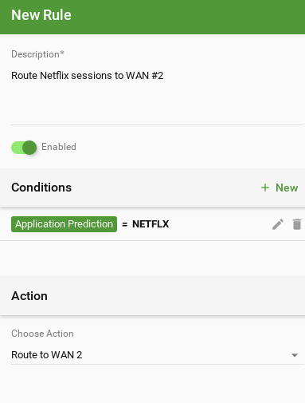

.. contents::

Predictive Routing
==================

This document describes some of the challenges and shortcomings of traditional routers, and how using new techniques these can be overcome with the advanced routing functions of the SD-WAN router.

First Packet Decision
---------------------

When a device (a client) communicates with another device (a server) on the internet it does so through a series of packets. This series of packets is usually called a session or a connection. Almost all commuincation on the internet are achieved through sessions with different purposes, such as an TCP session carrying HTTP to a web server, or a UDP session carrying DNS communications to a DNS server, etc.

Historically, the router at the endpoint (home, office, etc) has a very simple decision on how to route packets. If a packet is destined to a local device, send it on the local interface. If the packet is not bound to a local device, send it to the "default route" - out on the internet, usually called the "WAN" (Wide Area Network) interface. However, the modern internet is growing more complicated. Many routers now have multiple physical connections to the internet for redudancy or performance, and often these physical interfaces have very different performance characteristics. Additionally many routers now maintain various "virtual" internet connections through VPN tunnels to various cloud services, main offices, privacy proxies, etc.

The modern router faces a much more difficult challenge on how to route sessions as routers now have many distinct routes to the internet with different properties. For example, at my small hypothetical office, we have two internet connections for redundancy and multiple VPN tunnels for various purposes. We want netflix and youtube to use the high-bandwidth but somewhat higher latency "residential" internet connection because netflix and youtube use a lot of bandwidth but the latency requirements are not so important because of the buffering. We want VoiP calls and voice data to go through my more expensive low-latency business-class internet connection because VoiP requires less bandwidth but low latency is much more important. Additionally, we want all email related traffic to go to our VPN tunnel cloud email archival and relay service. We want all business and salesforce related traffic to go our corporate firewall running in the cloud. We also maintain a VPN for privacy issues for protocols like Bittorrent and newsgroups and social networking.

The challenge with these modern scenarios and using a traditional router is that the routing decision for an entire session must be made when choosing how to route the very first packet of th session. This is because of the nature of how (almost all) IP-based protocols work. The reply will come back the same route and the subsequent packets must follow the same route for communication to work. The crux of the issue means that the routing decision is made at the time of the first packet is being routed and very little useful information is actually available to the router at that time.

The information available at the time of the routing decision of the first packet is basically the information in the packet. This usually just amounts to an IP packet header with source and destination IPs and some mostly uninteresting (for routing purposes) fields. And usually some layer-4 packet header, like a UDP or TCP header, that may have some port fields and some other mostly uninteresting (for routing purposes) fields. This means we just know bascially IPs and ports. We can route based on source or destination IP, or source or destination ports, but to visit our earlier examples that doesn't help us with any of the routing decisions described earlier. Based on the IPs and ports we don't yet know that a session is going to be netflix, youtube, bittorrent, salesforce, gmail, etc. We don't know which sessions will need better latency or more bandwidth. We don't know which sessions are security sensitive or require a privacy or geographical proxy.

To overcome this challenge we're going to use an assortment of predictive routing techniques to properly route traffic to achieve the desired performance and security.

Prediction of Properties
------------------------

With the SD-WAN router we can use smart routing techniques to infer or predict the important information at the time the routing decision must be made. 

At the time the first packet arrives when we are making the routing decision we know many of the following:

* Info in the packet headers

  * Source IP
  * Destination IP
  * Source Port
  * Destination Port
  * IP Protocol (UDP/TCP etc)

But we also know a lot of information that is not in the packet:

- Out of band information
  
  - DNS Information
  - Certificate Information
  - Any Cloud-provided metadata on server
- Past network activity/behavior

  - Past DNS lookups
  - Past network activity

The goal of predictive routing is to use this information to infer or predict what this network session will be. Ideally we can predict the application but also other metadata such as how long will the session live, or how much data it will use, or what type of performance it requires.

The following examples provide some techniques to make better routing decisions, starting from the simple techniques to more advanced and powerful techniques. In order to keep the examples simple, we will discuss just using the predicted "Application" to route to a specific interface. You can, of course, use other predicted metadata to also control or maximize performance.

Reverse DNS Lookup
~~~~~~~~~~~~~~~~~~

The most basic technique is to perform a reverse DNS lookup of the IPs in the packet to determine their "internet names." This approach is simple and can in some cases be effective but has a couple large drawbacks.

To use this technique simply create a Routing Vote Rule that uses the "Server Reverse DNS" condition.
For example:

This will suggest a route of WAN 2 for any session that has a server IP that has a reverse DNS name that matches ".*netflix.com"

As mentioned earlier there are a couple drawbacks to this approach:

It requires a reverse DNS when processing traffic. A reverse DNS lookup could take 100 milliseconds, which is an eternity by packet-processing/firewall timeline standards. However, we can mostly work around this using asynchronous lookups and caches effectively so the delay is either not present at all, or only present on the first communication with the server in question.

The bigger issue is that the reverse DNS lookup almost never matches the forward-lookup. Even worse, this is actually not intuitive to most users and can lead to very frustrating results. The above example usually doesn't work at all!

Lets find the IP of netflix.com (currently for me)::

  # host netflix.com | head -n 1
  netflix.com has address 52.37.219.6

Now lets find what the reverse DNS name is of that IP::

  # host 52.37.219.6
  6.219.37.52.in-addr.arpa domain name pointer ec2-52-37-219-6.us-west-2.compute.amazonaws.com.

In this example the reverse lookup is "ec2-52-37-219-6.us-west-2.compute.amazonaws.com" which doesn't have "netflix" in it anywhere. In fact, its just a generic amazon EC2 machine in the us-west datacenter. So the above example doesn't actually work do what the user expects at all. This is very common with most large internet services. The reverse DNS information in most cases does not match the forward DNS lookup and in some cases the reverse DNS information does not exist at all.

DNS Hint
~~~~~~~~

A similarly simple but more effective technique is called 'DNS hinting' in which case the client will "hint" at a better domain name by doing a lookup prior to making a connection. The SD-WAN router accomplishes this by snooping on DNS lookups from various local clients, either to itself or DNS servers on the internet.

If the SD-WAN router sees a request for "youtube.com" from 192.168.1.100, and the result returned from the DNS server to 192.168.1.100 is "1.2.3.4". The SD-WAN records this information in a table storing recent DNS lookups and the results. If the router then sees a TCP connection initiated from 192.168.1.100 to 1.2.3.4 .2 seconds later, then is a very likely chance that the initial DNS request is related to the TCP session and that the iniator of that session is trying to reach "youtube.com".

This technique is called "DNS hinting" in which we just use the DNS lookups as hints to the proper DNS information associated with a session.

To use the earlier example to add a route vote rule for this use the "Server DNS Hint" condition:

Unlike the "Reverse DNS Name" example, this case will actually work as expected.

The downsides to this is that the DNS hint may not always be visible at the SD-WAN router, and in the long term DNS information will [should] be encrypted to prevent snooping.

Server Certificate CN
~~~~~~~~~~~~~~~~~~~~~

Another common and fairly simple technique is to pull information from the server certificate on the server. To accomplish this the SD-WAN router creates an out-of-line connection to the SSL server to retrieve the certificate. The certificate is stored in a cache for subsequent sessions. The certificate stores valuable information that can often be used to identify the application.

To use the same use case as before, just create route vote rule with a "Server Certificate Subject" condition:

In this case any session to a server that provides an SSL certificate that has "netflix.com" in the certificate common name field, will use WAN 2.
The other certificate conditions can be used to check other fields in the certificate.

The drawbacks to this approach is that it can cause a delay in the first session to a server to retrieve the certificate. This concern can mostly be mitigated in the real world with a cache. Alternatively, this can be configured to perform the lookup asynchronously or "passively snooped" so there is no delay, but the certificate information is unavailable on the first session.

The other drawback is that this approach only works with SSL-based protocols. Even for SSL-based applications in some cases the certificate does not provide perfect information. For example, google uses the same certificate for youtube.com and google.com so it is hard to tell from the certificate alone which "service" the client is connecting to.

Internet Map
~~~~~~~~~~~~

The "Internet Map" is a map of the internet built in the cloud based on a large amount of data harvested from monitoring internet traffic, including information provided by SD-WAN routers that have "cloud connection" and "data sharing" enabled.

"Data sharing" sends an anonymized aggregated of all public services and the corresponding application/protocol used to communicate with it. All traffic to to/from local clients and the source of the session is removed. All data is anonymized and corroborated and combined into a giant "Internet Map" that shows common destinations and the application almost certainly associated with that public destination. This map is periodically updated in the SD-WAN router or in some cases a cloud API call is used to fetch a specific entry in real-time.

An example of a entry in the map could be:
protocol=TCP,ip=1.2.3.4,port=443 application=EBAY

In this case, if we see a TCP connection to port 443 at 1.2.3.4, we know it is likely going to be ebay related traffic and that Application Control should later classify it as "EBAY". The fields on the left show the conditions, and the right side shows the resulting predictions if those conditions are met. The left side typically has conditions of data in the packet like "ip=" but conditions can include other metadata, such as DNS hints and certificates as well.

If Application Control later disagrees with this prediction this result will be sent to the cloud if "data sharing" is enabled. Data is continuously integrated in the cloud and updated maps are made available and downloaded by the SD-WAN routers.

This process builds a accurate map to predict application based on just metadata available at the time of the first packet. To use the internet map prediction to route a session create a rule like the following:

Machine Learning Prediction
~~~~~~~~~~~~~~~~~~~~~~~~~~~

Another approach is using the machine learning or AI to classify the session. Application Control in the SD-WAN router uses a variety of techniques to identify application traffic. It does so with a variety of techniques that involve looking at the content such as signatures and heuristics. Unfortunately, Application Control usually identifies the application after the first few packets and sometimes much later in the session. For routing purposes, this is irrelevent because the routing decision is made at the first packet and Application Control is usually not able to provide any information at this time.

However, often we can correctly predict the application based on the information available at the time of the first packet. Using the IP, port, and other information like the above discussed DNS and certificate information, the SD-WAN router uses several machine learning algorithms, such as Bayesian Networks, Neural Networks, and others, to build predictive models for predicting the Application at the time of the first packet.

Application Control identifications of past sessions provide the ideal training data for machine learning techniques to build an accurate prediction system for future sessions. Accuracy can be evaluated of predictions by comparing the prediction to the actual classification later performed by Application Control. All Application Control classifications provide training data, but classifications that do not match the predicition (incorrect predicitions) provide great training data to fix the predictive models.

Multiple predictive models are maintained to maximize accurate predictions. For example, A network prection model will be trained all sessions, but a per-client model will be trained with only a specific client's sessions. In some cases, such as when a client has very little traffic, the network prediction model will provide the most accurate (or only) prediction. But often the network-wide model has too wide of a training set for its size and a per client model trained on only the data for a particular client will be better trained and more accurate. A simple example of this would be a smart thermostat that only ever uses REST over HTTP on TCP port 80. While the network-wide model has access to the Client's IP and port as input, the training data for the whole network is likely to "bury" the significance that this IP only uses one application on port 80. The masses of other port 80 training data for the network-wide model makes it less likely to make an accurate predicition than the per-client model trained only on that client's data.

Varying models such as the network-model, per-client, per-server, and even per type-of-client etc, can be combined into one final prediction with a certainty rating. Additionally if "cloud connection" is enabled, various models are downloaded from the cloud trained on global data provided by SD-WAN routers deployed globally. These models provide prediction based on very large training from large data sets in the cloud and also provide great starting place for newly installed SD-WAN routers or applications never before seen on the network.

The "AI: Application Prediction" condition can be used to route traffic based on the prediction:

Additionally the Application Prediction Certainty (0%-100%) can be used to limit the action to only fairly certain predictions if desired.

Combined Prediction
~~~~~~~~~~~~~~~~~~~

The easiest approach is usually just to use the "combined" prediction. This condition combines the above techniques and uses a simple weighted eigenvector to combine them into a single accurate prediction.

To use our example this allows the admin to just add a rule "to send netflix out WAN 2" without having to worry about which prediction technique is the most accurate or how they work.

To do this simple add the following rule:

Behind the scenes this combines the above techniques. In reality this usually means that if the prediction is in the internet map, use it, otherwise look for another predictive technique like AI, and if all else fails infer it from the DNS/cert information available.

